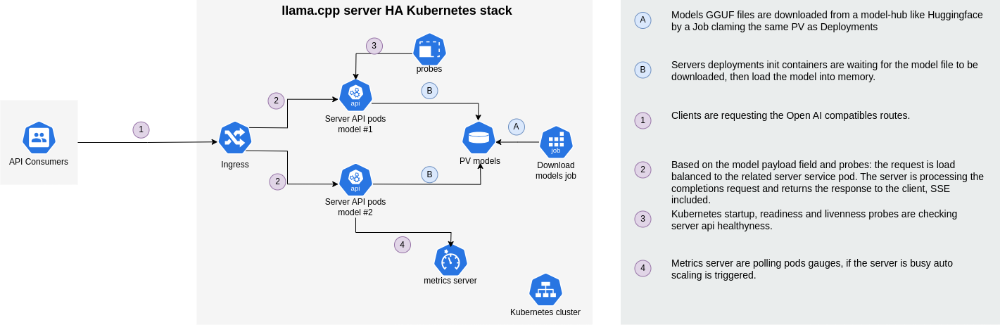

# llama.cpp/example/kubernetes

This example demonstrates how to deploy [llama.cpp server](../server) on a [kubernetes cluster](https://kubernetes.io).



We provide an [Helm chart](https://helm.sh/)  repository to deploy llama.cpp at scale for completions and embeddings:

```shell

helm repo add llama.cpp https://ggerganov.github.io/llama.cpp
helm repo update
helm install example llama-cpp --namespace llama-cpp --create-namespace
```

## Prerequisites

Obviously you need a kubernetes cluster.

Required access to an API server with the following `roles`:

- verbs: `["get", "list", "watch", "create", "update", "patch", "delete"]` 
- resources: `["pods", "deployments", "services", "pvc", "jobs", "ingresses]`

If you do not have a real k8s cluster, you can give a try to [kind](https://kind.sigs.k8s.io/).

### Metrics monitoring

You might want to deploy prometheus helm chart:

```shell
helm repo add prometheus-community https://prometheus-community.github.io/helm-charts
helm repo update
helm install \
    --set prometheus.prometheusSpec.podMonitorSelectorNilUseHelmValues=false \
    kube-prometheus-stack prometheus-community/kube-prometheus-stack \
    --create-namespace \
    --namespace monitoring
```

## Goals

Deploy a production ready LLM API over kubernetes, including:
- High availability
- multi models
- support of embeddings and completions models
- load balancing
- Auto scaling
- Security 

### Limitations
This example does not cover [NVidia based docker engine](https://docs.nvidia.com/datacenter/cloud-native/container-toolkit/latest/install-guide.html), the target architecture remains the same, just switch to [cuda based images](../../.devops/server-cuda.Dockerfile).

## Proposed architectures

**Constraints:**
- llama.cpp server is mono model
- GGUF models files are heavy (even quantized)

**Approach**
1. Models file are downloaded once on a `PV` by a `Job` when the stack is deployed
2. Server `Deployment` is using an init containers to verify if the model is downloaded
3. `Ingress` rules are routing incoming request to the target models
3. `Probes` are used to monitor the `pods` healthiness
4. [Prometheus](https://prometheus.io/) is used as the metrics server

